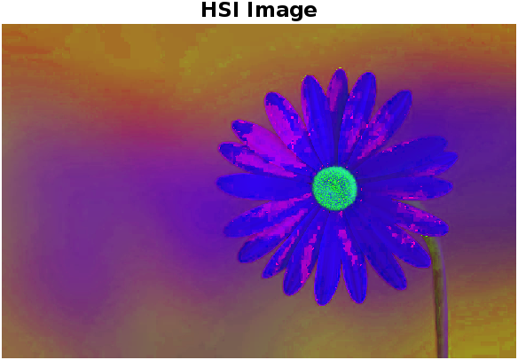

# Edge Detection with Color
A MATLAB project to examine edge detection results across grayscale, Intensity (I), and Hue (H) components of a picture using the HSI colour space to determine the best successful way for capturing unique edges.


## Problem Description
In this project, we explore various methods of edge detection in the context of color images. The task involves the following steps:

    1. Choose a color image.
    2. Convert it to grayscale using the average of all three color channels.
    3. Find edges in the grayscale image using any preferred edge detection method.
    4. Convert the original image to the HSI color space.
    5. Find edges on the Intensity (I) component using the same method used for the grayscale image.
    6. Find edges on the Hue (H) component using the same method.
    7. Compare the three sets of edge-detected images and discuss their similarities and differences.
    8. Determine which method produces the best results and provide reasoning for your choice.


## Solution
We have implemented this project using MATLAB. Below is a summary of the solution steps and the code used:

#### Step 1: RGB to Grayscale Conversion
```matlab
% MATLAB code for converting RGB to Grayscale
k = imread("flower.jpg");
k = double(k);
k1 = (k(:,:,1) + k(:,:,2) + k(:,:,3)) / 3;
imtool(uint8(k1), []);
```

#### Step 2: Finding Edges (Grayscale)
```matlab
% MATLAB code for finding edges using Prewitt method (Grayscale)
BW1 = edge(k1, 'Prewitt');
imshow(BW1);
title('Image 1');
```
#### Step 3: RGB to HSI Conversion
```matlab
% MATLAB code for converting RGB to HSI
I = double(k) / 255;
R = I(:,:,1);
G = I(:,:,2);
B = I(:,:,3);

% HSI conversion code
% ...
```
#### Step 4: Finding Edges (HSI - Intensity Component)
```matlab
% MATLAB code for finding edges using Prewitt method (HSI - Intensity Component)
BW2 = edge(I, 'Prewitt');
imshow(BW2);
title('Image 2');
```
#### Step 5: Finding Edges (HSI - Hue Component)
```matlab
% MATLAB code for finding edges using Prewitt method (HSI - Hue Component)
BW3 = edge(H, 'Prewitt');
imshow(BW3);
title('Image 3');
```
## Function Used
* imread(): Read the image.
* imtool() and imshow(): Display the image.
* edge(): Find edges in the image.
* title(): Add a title to the displayed image.


## Input Images
* Original RGB image.
  


* Grayscale converted image.
  


* HSI converted image.
  


## Output Images
* Edges using the Prewitt method on grayscale image (Image 1).
  


* Edges using the Prewitt method on HSI image (Intensity Component) (Image 2).
  


* Edges using the Prewitt method on HSI image (Hue Component) (Image 3).


## Conclusion
When the three edge-detected pictures are compared, it is clear that Image 1 (Prewitt edges on grayscale image) and Image 2 (Prewitt edges on HSI image - Intensity Component) are quite similar. Image 3 (Prewitt edges on the HSI image - Hue Component) is, nonetheless, distinct from the other two. Image 1 and Image 2 both correctly represent the image's edges, making them preferred alternatives to Image 3.

## Authors

- [@Shubham Singh](https://github.com/Shubham722-227)


## License

[](https://choosealicense.com/licenses/mit/)

